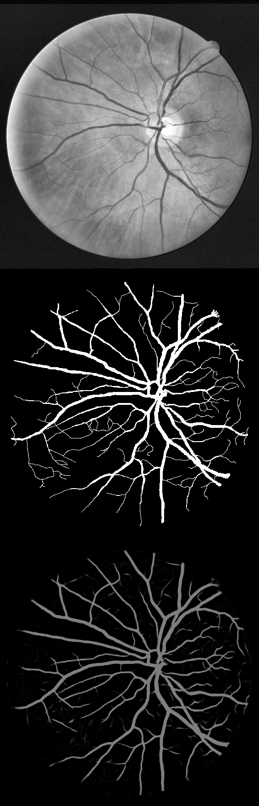

# Retina blood vessel segmentation with a convolution neural network (U-net)



This repository contains the implementation of a convolutional neural network used to segment blood vessels in retina fundus images. This is a binary classification task: the neural network predicts if each pixel in the fundus image is either a vessel or not.  
The neural network structure is derived from the *U-Net* architecture, described in this [paper](https://arxiv.org/pdf/1505.04597.pdf).  
The performance of this neural network is tested on the DRIVE database, and it achieves the best score in terms of area under the ROC curve in comparison to the other methods published so far. Also on the STARE datasets, this method reports one of the best performances.


## Methods
Before training, the 20 images of the DRIVE training datasets are pre-processed with the following transformations:
- Gray-scale conversion
- Standardization
- Contrast-limited adaptive histogram equalization (CLAHE)
- Gamma adjustment

The training of the neural network is performed on sub-images (patches) of the pre-processed full images. Each patch, of dimension 48x48, is obtained by randomly selecting its center inside the full image. Also the patches partially or completely outside the Field Of View (FOV) are selected, in this way the neural network learns how to discriminate the FOV border from blood vessels.  
A set of 190000 patches is obtained by randomly extracting 9500 patches in each of the 20 DRIVE training images. Although the patches overlap, i.e. different patches may contain same part of the original images, no further data augmentation is performed. The first 90% of the dataset is used for training (171000 patches), while the last 10% is used for validation (19000 patches).

The neural network architecture is derived from the *U-net* architecture (see the [paper](https://arxiv.org/pdf/1505.04597.pdf)).
The loss function is the cross-entropy and the stochastic gradient descent is employed for optimization. The activation function after each convolutional layer is the Rectifier Linear Unit (ReLU), and a dropout of 0.2 is used between two consecutive convolutional layers.  
Training is performed for 150 epochs, with a mini-batch size of 32 patches. Using a GeForce GTX TITAN GPU the training lasts for about 20 hours.


## Results on DRIVE database
Testing is performed with the 20 images of the DRIVE testing dataset, using the gold standard as ground truth. Only the pixels belonging to the FOV are considered. The FOV is identified with the masks included in the DRIVE database.  
In order to improve the performance, the vessel probability of each pixel is obtained by averaging multiple predictions. With a stride of 5 pixels in both height and width, multiple consecutive overlapping patches are extracted in each testing image. Then, for each pixel, the vessel probability is obtained by averaging probabilities over all the predicted patches covering the pixel.

The results reported in the `./test` folder are referred to the trained model which reported the minimum validation loss. The `./test` folder includes:
- Model:
  - `test_model.png` schematic representation of the neural network
  - `test_architecture.json` description of the model in json format
  - `test_best_weights.h5` weights of the model which reported the minimum validation loss, as HDF5 file
  - `test_last_weights.h5`  weights of the model at last epoch (150th), as HDF5 file
  - `test_configuration.txt` configuration of the parameters of the experiment
- Experiment results:
  - `performances.txt` summary of the test results, including the confusion matrix
  - `Precision_recall.png` the precision-recall plot and the corresponding Area Under the Curve (AUC)
  - `ROC.png` the Receiver Operating Characteristic (ROC) curve and the corresponding AUC
  - `all_*.png` the 20 images of the pre-processed originals, ground truth and predictions relative to the DRIVE testing dataset
  - `sample_input_*.png` sample of 40 patches of the pre-processed original training images and the corresponding ground truth
  - `test_Original_GroundTruth_Prediction*.png` from top to bottom, the original pre-processed image, the ground truth and the prediction. In the predicted image, each pixel shows the vessel predicted probability, no threshold is applied.


The following table compares this method to other recent techniques, which have published their performance in terms of Area Under the ROC curve (AUC ROC) on the DRIVE dataset.

| Method                  | AUC ROC on DRIVE |
| ----------------------- |:----------------:|
| Soares et al [1]        | .9614            |
| Azzopardi et al. [2]    | .9614            |
| Osareh et al  [3]       | .9650            |
| Roychowdhury et al. [4] | .9670            |
| Fraz et al.  [5]        | .9747            |
| Qiaoliang et al. [6]    | .9738            |
| Melinscak et al. [7]    | .9749            |
| Liskowski et al.^ [8]   | .9790            |
| **this method**         | **.9790**        |

^ different definition of FOV

## Running the experiment on DRIVE
The code is written in Python, it is possible to replicate the experiment on the DRIVE database by following the guidelines below.


### Prerequisities
The neural network is developed with the Keras library, we refer to the [Keras repository](https://github.com/fchollet/keras) for the installation.

This code has been tested with Keras 1.1.0, using either Theano or TensorFlow as backend. In order to avoid dimensions mismatch, it is important to set `"image_dim_ordering": "th"` in the `~/.keras/keras.json` configuration file. If this file isn't there, you can create it. See the Keras documentation for more details.

The following dependencies are needed:
- numpy >= 1.11.1
- PIL >=1.1.7
- opencv >=2.4.10
- h5py >=2.6.0
- ConfigParser >=3.5.0b2
- scikit-learn >= 0.17.1


Also, you will need the DRIVE database, which can be freely downloaded as explained in the next section.

### Training

First of all, you need the DRIVE database. We are not allowed to provide the data here, but you can download the DRIVE database at the official [website](http://www.isi.uu.nl/Research/Databases/DRIVE/). Extract the images to a folder, and call it "DRIVE", for example. This folder should have the following tree:
```
DRIVE
│
└───test
|    ├───1st_manual
|    └───2nd_manual
|    └───images
|    └───mask
│
└───training
    ├───1st_manual
    └───images
    └───mask
```
We refer to the DRIVE website for the description of the data.

It is convenient to create HDF5 datasets of the ground truth, masks and images for both training and testing.
In the root folder, just run:
```
python prepare_datasets_DRIVE.py
```
The HDF5 datasets for training and testing will be created in the folder `./DRIVE_datasets_training_testing/`.  
N.B: If you gave a different name for the DRIVE folder, you need to specify it in the `prepare_datasets_DRIVE.py` file.

Now we can configure the experiment. All the settings can be specified in the file `configuration.txt`, organized in the following sections:  
**[data paths]**  
Change these paths only if you have modified the `prepare_datasets_DRIVE.py` file.  
**[experiment name]**  
Choose a name for the experiment, a folder with the same name will be created and will contain all the results and the trained neural networks.  
**[data attributes]**  
The network is trained on sub-images (patches) of the original full images, specify here the dimension of the patches.  
**[training settings]**  
Here you can specify:  
- *N_subimgs*: total number of patches randomly extracted from the original full images. This number must be a multiple of 20, since an equal number of patches is extracted in each of the 20 original training images.
- *inside_FOV*: choose if the patches must be selected only completely inside the FOV. The neural network correctly learns how to exclude the FOV border if also the patches including the mask are selected. However, a higher number of patches are required for training.
- *N_epochs*: number of training epochs.
- *batch_size*: mini batch size.
- *nohup*: the standard output during the training is redirected and saved in a log file.


After all the parameters have been configured, you can train the neural network with:
```
python run_training.py
```
If available, a GPU will be used.  
The following files will be saved in the folder with the same name of the experiment:
- model architecture (json)
- picture of the model structure (png)
- a copy of the configuration file
- model weights at last epoch (HDF5)
- model weights at best epoch, i.e. minimum validation loss (HDF5)
- sample of the training patches and their corresponding ground truth (png)


### Evaluate the trained model
The performance of the trained model is evaluated against the DRIVE testing dataset, consisting of 20 images (as many as in the training set).

The parameters for the testing can be tuned again in the `configuration.txt` file, specifically in the [testing settings] section, as described below:  
**[testing settings]**  
- *best_last*: choose the model for prediction on the testing dataset: best = the model with the lowest validation loss obtained during the training; last = the model at the last epoch.
- *full_images_to_test*: number of full images for testing, max 20.
- *N_group_visual*: choose how many images per row in the saved figures.
- *average_mode*: if true, the predicted vessel probability for each pixel is computed by averaging the predicted probability over multiple overlapping patches covering the same pixel.
- *stride_height*: relevant only if average_mode is True. The stride along the height for the overlapping patches, smaller stride gives higher number of patches.
- *stride_width*: same as stride_height.
- *nohup*: the standard output during the prediction is redirected and saved in a log file.

The section **[experiment name]** must be the name of the experiment you want to test, while **[data paths]** contains the paths to the testing datasets. Now the section **[training settings]** will be ignored.

Run testing by:
```
python run_testing.py
```
If available, a GPU will be used.  
The following files will be saved in the folder with same name of the experiment:
- The ROC curve  (png)
- The Precision-recall curve (png)
- Picture of all the testing pre-processed images (png)
- Picture of all the corresponding segmentation ground truth (png)
- Picture of all the corresponding segmentation predictions (png)
- One or more pictures including (top to bottom): original pre-processed image, ground truth, prediction
- Report on the performance

All the results are referred only to the pixels belonging to the FOV, selected by the masks included in the DRIVE database


## Results on STARE database

This neural network has been tested also on another common database, the [STARE](http://cecas.clemson.edu/~ahoover/stare/). The neural network is identical as in the experiment with the DRIVE dataset, however some modifications in the code and in the methodology were necessary due to the differences between the two datasets.  
The STARE consists of 20 retinal fundus images with two sets of manual segmentation provided by two different observers, with the former one considered as the ground truth. Conversely to the DRIVE dataset, there is no standard division into train and test images, therefore the experiment has been performed with the *leave-one-out* method. The training-testing cycle has been repeated 20 times: at each iteration one image has been left out from the training set and then used for the test.  
The pre-processing is the same applied for the DRIVE dataset, and 9500 random patches of 48x48 pixels each are extracted from each of the 19 images forming the training set. Also the area outside the FOV has been considered for the patch extraction. From these patches, 90% (162450 patches) are used for training and 10% (18050 patches) are used for validation.  The training parameters (epochs, batch size...) are the same as in the DRIVE experiment.  
The test is performed each time on the single image left out from the training dataset. Similarly to the DRIVE dataset, the vessel probability of each pixel is obtained by averaging over multiple overlapping patches, obtained with a stride of 5 pixels in both width and height. Only the pixels belonging to the FOV are considered. This time the FOV is identified by applying a color threshold in the original images, since no masks are available in the STARE dataset.  

The following table shows the results (in terms of AUC ROC) obtained over the 20 different trainings, with the stated image used for test.

| STARE image| AUC ROC|
| ---------- |:------:|
| im0239.ppm | .9751 |
| im0324.ppm | .9661 |
| im0139.ppm | .9845 |
| im0082.ppm | .9929 |
| im0240.ppm | .9832 |
| im0003.ppm | .9856 |
| im0319.ppm | .9702 |
| im0163.ppm | .9952 |
| im0077.ppm | .9925 |
| im0162.ppm | .9913 |
| im0081.ppm | .9930 |
| im0291.ppm | .9635 |
| im0005.ppm | .9703 |
| im0235.ppm | .9912 |
| im0004.ppm | .9732 |
| im0044.ppm | .9883 |
| im0001.ppm | .9709 |
| im0002.ppm | .9588 |
| im0236.ppm | .9893 |
| im0255.ppm | .9819 |

__AVERAGE:   .9805 +- .0113__

The folder `./STARE_results` contains all the predictions. Each image shows (from top to bottom) the pre-processed original image of the STARE dataset, the ground truth and the corresponding prediction. In the predicted image, each pixel shows the vessel predicted probability, no threshold is applied.

The following table compares this method to other recent techniques, which have published their performance in terms of Area Under the ROC curve (AUC ROC) on the STARE dataset.

| Method                  | AUC ROC on STARE |
| ----------------------- |:----------------:|
| Soares et al [1]        | .9671           |
| Azzopardi et al. [2]    | .9563            |
| Roychowdhury et al. [4] | .9688            |
| Fraz et al.  [5]        | .9768            |
| Qiaoliang et al. [6]    | .9879            |
| Liskowski et al.^ [8]   | .9930            |
| **this method**         | **.9805**        |

^ different definition of FOV

## Bibliography

[1] Soares et al., “Retinal vessel segmentation using the 2-d Gabor wavelet and supervised classification,” *Medical Imaging, IEEE Transactions on*, vol. 25, no. 9, pp. 1214–1222, 2006.

[2] Azzopardi et al., “Trainable cosfire filters for vessel delineation with application to retinal images,”
*Medical image analysis*, vol. 19, no. 1, pp. 46–57, 2015.

[3] Osareh et al., “Automatic blood vessel segmentation in color images of retina,” *Iran. J. Sci. Technol. Trans. B: Engineering*, vol. 33, no. B2, pp. 191–206, 2009.

[4] Roychowdhury et al., “Blood vessel segmentation of fundus images by major vessel extraction and subimage
classification,” *Biomedical and Health Informatics, IEEE Journal of*, vol. 19, no. 3, pp. 1118–1128, 2015.

[5] Fraz et al., "An Ensemble Classification-Based Approach Applied to Retinal Blood Vessel Segmentation",   *IEEE Transactions on Biomedical Engineering*, vol. 59, no. 9, pp. 2538-2548, 2012.

[6] Qiaoliang et al., "A Cross-Modality Learning Approach for Vessel Segmentation in Retinal Images", *IEEE Transactions on Medical Imaging*, vol. 35, no. 1, pp. 109-118, 2016.

[7] Melinscak et al., "Retinal vessel segmentation using deep neural networks", *In Proceedings of the 10th International Conference on Computer Vision Theory and Applications (VISIGRAPP 2015)*, (2015), pp. 577–582.

[8] Liskowski et al., "Segmenting Retinal Blood Vessels with Deep Neural Networks",  *IEEE Transactions on Medical Imaging*, vol. PP, no. 99, pp. 1-1, 2016.


## Acknowledgements

This work was supported by the EU Marie Curie Initial Training Network (ITN) “REtinal VAscular Modelling, Measurement And Diagnosis" (REVAMMAD), Project no. 316990.

## License

This project is licensed under the MIT License

Copyright (c) 2016 Daniele Cortinovis, Orobix Srl (www.orobix.com).
